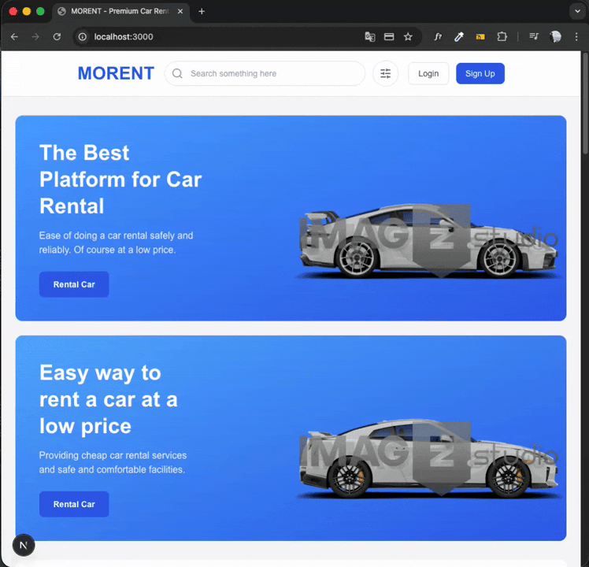

# 🚗 Morent – ​​Car Rental App

Morent is a full-stack car rental app developed using modern technologies. Users can list and filter vehicles, make reservations, and complete payments.

## 🚀 Features

* User registration and login (NextAuth)
* Vehicle listing and detail pages
* Filtering, sorting, and searching
* Secure payment integration with Stripe
* Admin interface: add/update/delete vehicles
* Data management via MongoDB
* Responsive modern UI
* Toast notifications
* Load sample vehicle data with seed script

## 🛠️ Technologies Used
- Next.js 15
- React 19
- TailwindCSS 4
- Lucide Icons
- React Toastify
- Next.js API Routes
- MongoDB & Mongoose
- NextAuth (Authentication)
- Stripe (Payment Processing)
- TypeScript
- bcryptjs
- tsx

## 🖼️ Screenshots

